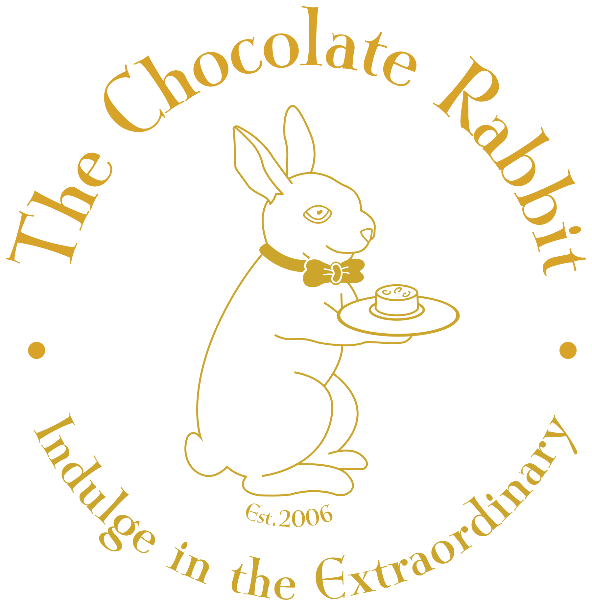

# The Chocolate Rabbit for Windows

The Chocolate Rabbit newsletter sign-up app for Windows: the "Join Our Newsletter" page as a
desktop program, built with WPF on .NET 8 in the same structure as
[Stream Arc TV for Windows](../windows/), with the same built-in updater.

<p align="center"></p>

## What it does

- The sign-up page from the design: the chocolate bunny hero photo, The Chocolate Rabbit logo top
  left, "A SWEETER WORLD" and the menu top right, **Join Our** (Allura script) **Newsletter**
  (Playfair Display) in gold, the body copy in Lora, the "Your name" and "Your email" fields
  (56 px, 12 px corners, icons on the left), the gold **SUBSCRIBE** button, and the
  "MORE THAN CHOCOLATE" / "SWEETER TOGETHER" taglines. Two columns when the window is wide,
  one column over the photo when it is narrow; F11 is full screen.
- **Sign-ups go to info@thechocolaterabbit.ca** for now, because the newsletter service itself
  is not finished: SUBSCRIBE checks the name and email, opens the user's email app with a message
  to that address already filled in (name, email, date), and asks them to press Send. If the PC
  has no email app, the details are shown with a "Copy details" button instead. A copy of every
  sign-up is also appended to `%LocalAppData%\TheChocolateRabbit\signups.jsonl`, one JSON object
  per line, so nothing is lost. The address lives in `Directory.Build.props` (`NewsletterEmail`)
  and can be switched to the real newsletter endpoint later.
- **Self-updating**, exactly like Stream Arc TV: the menu's "Check for updates" (and a check two
  seconds after launch, which can be turned off in the menu) reads this repository's
  `release/update-chocolate-rabbit.json`, shows the release notes, downloads the new setup
  program with a progress dialog, verifies its SHA-256 and size, and runs it silently; the
  installer closes the app, replaces the files and starts it again. A portable copy (from the
  zip) swaps its files in place instead. Any version can be skipped.
- Menu (the ☰ button): Check for updates · Check for updates on launch on/off · Release notes
  and downloads · Export log · About · Exit.
- Crash safety net: if the app ever closes unexpectedly, the next start offers to save the log.

## Install

1. Download `The-Chocolate-Rabbit-Setup-<version>.exe` from the [Releases](../../../releases)
   page (the releases tagged `chocolate-rabbit-v…`) and run it. It installs for the current user
   without asking for administrator rights, adds Start menu and desktop shortcuts and an
   Apps & features entry, and can start the app when it finishes. Nothing else needs installing:
   .NET is included.
2. Windows SmartScreen may warn the first time because the build is not code-signed; choose
   "More info" → "Run anyway".
3. Future updates install from inside the app.

Prefer no installer? `The-Chocolate-Rabbit-Windows-<version>-x64.zip` is the same build as a
portable folder: unpack it anywhere you have write access and run `TheChocolateRabbit.exe`.

Uninstall from Settings → Apps (or the Start menu entry). Settings, the local sign-up record and
logs under `%LocalAppData%\TheChocolateRabbit` are kept.

Requires Windows 10 or 11, 64-bit.

## Hero photo

`TheChocolateRabbit/Assets/hero_bg.jpg` is a warm, blurred chocolate-shop background standing in
for the chocolate bunny photograph from the design (the photo itself was not part of the source
files). Drop the real photo in under the same name (a 4:3 image of about 2048×1536 works well,
bunny on the left, dark on the right) and rebuild; nothing else needs to change.

## Configuration

The version, update repository and the sign-up address live in `chocolate-rabbit/Directory.Build.props`:

```xml
<Version>1.0.0</Version>
<GitHubRepo>ComputerGarage1837/StreamArcTV</GitHubRepo>
<NewsletterEmail>info@thechocolaterabbit.ca</NewsletterEmail>
```

Build locally (Windows, or any OS with the .NET 8 SDK for a compile check):

```
dotnet build chocolate-rabbit/TheChocolateRabbit/TheChocolateRabbit.csproj -c Release
```

Publish a runnable folder:

```
dotnet publish chocolate-rabbit/TheChocolateRabbit/TheChocolateRabbit.csproj -c Release -r win-x64 --self-contained -o out/TheChocolateRabbit
```

## Releasing

Releases are built and published by GitHub Actions (`.github/workflows/chocolate-rabbit.yml`).
No secrets are needed (the build is unsigned).

To ship a version:

1. Bump `<Version>` in `chocolate-rabbit/Directory.Build.props` (the version code is
   `major*10000 + minor*100 + patch` and must exceed the `versionCode` in
   `release/update-chocolate-rabbit.json`).
2. Add a `## vX.Y.Z — date` section to `chocolate-rabbit/CHANGELOG.md`; it becomes the release
   notes shown in the app.
3. Commit and push to `main` (or merge a pull request).

When `main` carries a version that has no `chocolate-rabbit-vX.Y.Z` release yet, the workflow
publishes the setup program (built with Inno Setup from `installer/TheChocolateRabbit.iss`) and
the portable x64 zip on a release named "The Chocolate Rabbit for Windows X.Y.Z", then commits
the matching `release/update-chocolate-rabbit.json` (with SHA-256 and size of each) to `main`.
Pushing a `chocolate-rabbit-v*` tag by hand or running the workflow manually does the same.
Pull requests and pushes that don't bump the version only build the app as a check.

## Update format

`release/update-chocolate-rabbit.json` uses the same schema as the Stream Arc TV Windows feed
(see [`UPDATE_FORMAT.md`](../UPDATE_FORMAT.md)), with `packageName`
`ca.thechocolaterabbit.app.windows` and release tags `chocolate-rabbit-v<versionName>`.
A `versionCode` of 0 means no release has been published yet.

## Branding

`branding/` holds the logo as supplied (`the-chocolate-rabbit-logo.pdf`) and the transparent
gold rendering of it used in the app and for the icon. The fonts (Playfair Display, Allura, Lora;
SIL Open Font License) are bundled in `TheChocolateRabbit/Assets/Fonts`.
